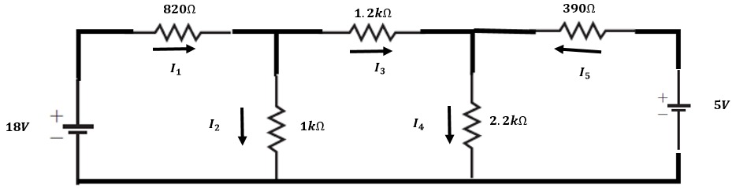
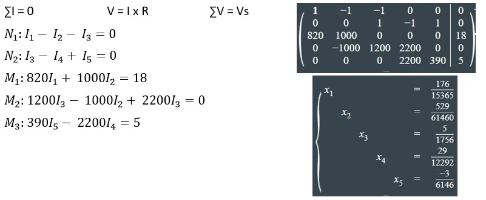

# Laboratorio-2

1. OBJETIVO GENERAL 

   OBJETIVOS ESPECIFICOS

2. MARCO TEÓRICO

3. EXPLICACIÓN DEL PROCEDIMIENTO

Circuito Analítico

Circuito Simulado

4. RESPUESTA A INTERROGANTES Y CALCULO DEL ERROR

Tabla 2.1. Resultados obtenidos para el circuito de la figura 2.1.

5. VIDEO

6. CONCLUSIONES

7. BIBLIOGRAFÍA
