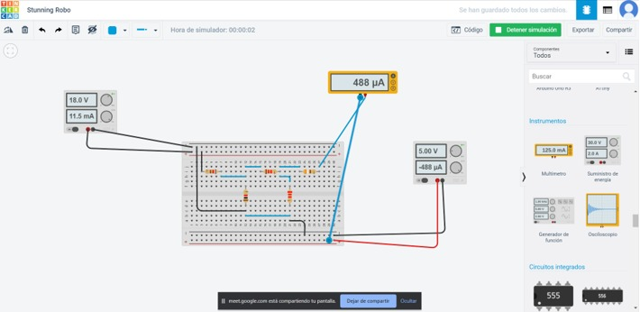
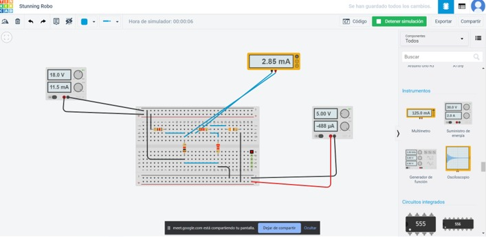

# Laboratorio-2

1. OBJETIVO GENERAL 

Entender el método de análisis de malla, y poder establecer una relación entre el uso de la ley de Ohm y las leyes de Kirchhoff, ademas de conocer los conceptos básicos del análisis de malla

   OBJETIVOS ESPECIFICO 
   
Estudiar la aplicación del método de corrientes de malla a circuitos con la aplicación de formulas conocidas de ley de Ohm etc, para poder calcular los valores no encontrados 
 
Identificar la forma correcta de medición de corriente y voltaje con los instrumentos del simulador como son el multímetro para los circuitos,  y mas especificamente de los circuitos analizados por mallas

2. MARCO TEÓRICO

3. EXPLICACIÓN DEL PROCEDIMIENTO

Circuito Analítico

Circuito Simulado

4. RESPUESTA A INTERROGANTES Y CALCULO DEL ERROR

Tabla 2.1. Resultados obtenidos para el circuito de la figura 2.1.
 
 
 
  

5. VIDEO

https://www.youtube.com/watch?v=NT58wd0VSss 

6. CONCLUSIONES

Como conclusión podemos decir que se logró verificar exitosamente los métodos de análisis de mallas con la ayuda del simulador que luego se verifico en la práctica y también al realizar el informe es así que se puede decir que los datos que se obtuvieron en la practica fueron tomados de la mejor manera con un bajo margen de error.

A través de la práctica del laboratorio podemos comprobar la teoría en este caso de las leyes de Kirchhoff, y con la ayuda de estas y formulas de ohm poder encontrar los valores no conocidos 

Como recomendación se diría que debemos ser ordenados al momento de armar el circuito ya que un elemento mal conectado puede provocar el daño del equipo o medidas erróneas.

7. BIBLIOGRAFÍA

Analisis de Mallas. (3 de Febrero de 2018). Obtenido de https://hetpro-store.com/TUTORIALES/ley-de-kirchhoff-analisis-de-mallas/

Geovanny. (2 de Octubre de 2016). Analisis de circuitos en Ingeniería. Obtenido de https://analisisdecircuitos1.wordpress.com/parte-1-circuitos-resistivos-cap-21-a-30-en-construccion/capitulo-21-analisis-de-mallas/

McAllister, W. (13 de marzo de 2019).KHAN ACADEMY. Obtenido de https://es.khanacademy.org/science/electrical-engineering/ee-circuit-analysis-topic/ee-dc-circuit-analysis/a/ee-mesh-current-method

Nilsson. (22 de junio de 2002). Wikipedia. Obtenido de https://es.wikipedia.org/wiki/An%C3%A1lisis_de_mallas

